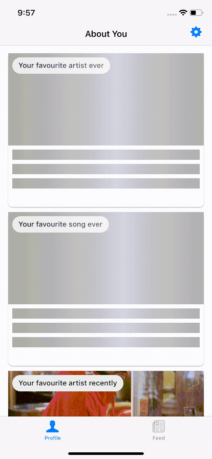

# Wilt - What I Listen To

[](https://travis-ci.org/oliveroneill/wilt-ios)

This is an iOS client for displaying Wilt metrics.

The server-side and browser version of the client is [here](https://github.com/oliveroneill/wilt).
The server-side uses Firebase and BigQuery. The Android app is available
[here](https://github.com/oliveroneill/wilt-android).

## Installation
We use [cocoapods-keys](https://github.com/orta/cocoapods-keys) to store
secrets.
Run
```bash
pod install
```
This will prompt you for your Spotify Client ID and Spotify redirect URI.

Put your `GoogleService-Info.plist` file in `Wilt/`. Generate this file via the
Firebase console for iOS integration.

## The app in action



